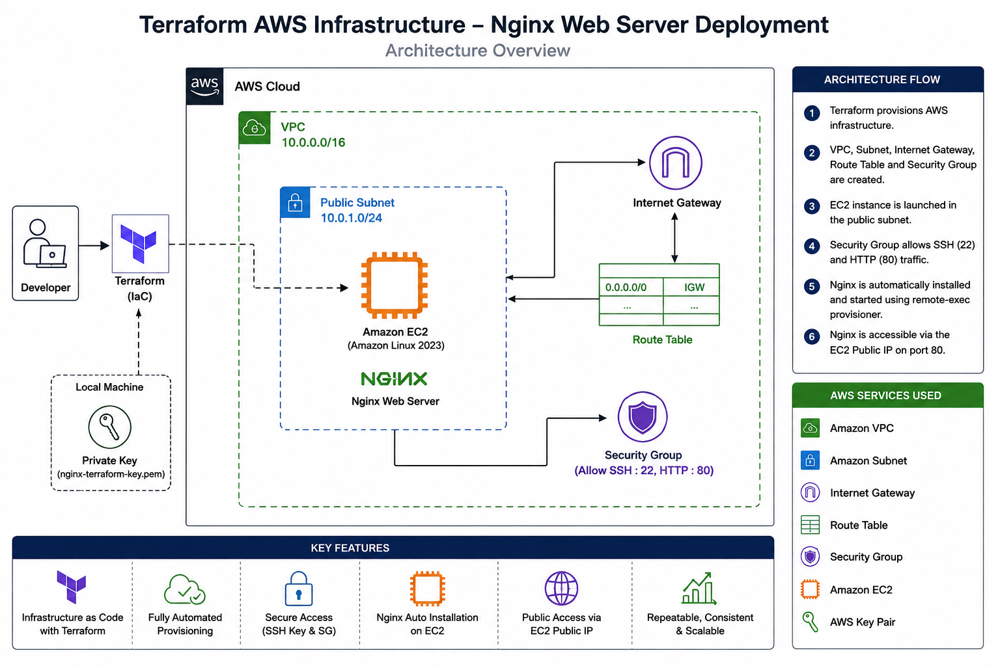

# 🚀 Terraform AWS Infrastructure Automation – Nginx Web Server Deployment

## 📖 Overview

This project demonstrates Infrastructure as Code (IaC) by provisioning a complete AWS environment using Terraform. It automates the deployment of a secure Virtual Private Cloud (VPC), networking components, security configurations, and an Amazon EC2 instance running an Nginx web server.

The infrastructure is fully automated, from creating the networking resources to generating an SSH key pair, launching the EC2 instance, installing Nginx, and providing outputs such as the web server URL and SSH connection command. This project highlights the benefits of Infrastructure as Code, including repeatable deployments, consistency, automation, and simplified infrastructure management.

## 🎯 Business Problem

Provisioning cloud infrastructure manually is time-consuming, error-prone, and difficult to maintain consistently across environments. Organizations require an automated and repeatable approach to deploy secure infrastructure while reducing manual configuration and operational overhead.

This project addresses these challenges by using Terraform to automate the provisioning of AWS infrastructure, including networking, security groups, EC2 instances, and web server installation. The solution ensures consistent deployments, improves operational efficiency, and demonstrates Infrastructure as Code (IaC) best practices.

## 🏗 Architecture

  

## ☁️ AWS Services Used
🔹 Amazon VPC
🔹 Public Subnet
🔹 Internet Gateway
🔹 Route Table
🔹 Security Groups
🔹 Amazon EC2
🔹 AWS Key Pair
🔹 IAM (Access Permissions)

## 🛠️ Technologies
- Terraform
- AWS
- Amazon Linux 2023
- Nginx
- SSH
- TLS Provider
- Local Provider

## ✨ Features
- 🏗️ Fully automated AWS infrastructure provisioning using Terraform
- 🌐 Deploys a secure VPC with public networking components
- 🛡️ Implements secure access using Security Groups and SSH key management
- 🖥️ Launches an Amazon Linux 2023 EC2 instance automatically
- ⚡ Installs and starts the Nginx web server without manual intervention
- 🔄 Uses dynamic AMI lookup for the latest Amazon Linux image
- 📡 Enables internet connectivity through an Internet Gateway and Route Table
- 📋 Provides Terraform outputs for EC2 Public IP, Nginx URL, and SSH access
- 🚀 Ensures repeatable, scalable, and version-controlled deployments
- 💰 Minimizes manual effort through Infrastructure as Code (IaC)

## ⚙ Deployment Steps
1. Clone the repository to your local machine.
2. Configure AWS CLI credentials with appropriate IAM permissions.
3. Initialize the Terraform working directory.
4. Validate and review the Terraform execution plan.
5. Apply the Terraform configuration to provision the AWS infrastructure.
6. Wait for Terraform to create the VPC, networking components, EC2 instance, and install Nginx automatically.
7. Retrieve the EC2 Public IP or Nginx URL from the Terraform outputs.
8. Open the URL in a web browser to verify the Nginx web server deployment.
9. Connect to the EC2 instance using the generated SSH key (if required).
10. Destroy the infrastructure using Terraform when it is no longer needed.

## 💡 Challenges & Solutions
| Challenge | Solution |
|-----------|----------|
| Automating AWS infrastructure provisioning | Used Terraform to provision the complete AWS infrastructure as Infrastructure as Code (IaC), ensuring consistent and repeatable deployments. |
| Creating a secure networking environment | Configured a custom Amazon VPC, public subnet, Internet Gateway, and Route Table to provide secure and controlled network connectivity. |
| Managing secure SSH access | Generated an SSH key pair using the Terraform TLS provider and securely stored the private key locally for EC2 access. |
| Configuring network security | Implemented an AWS Security Group to allow only HTTP (80) and SSH (22) inbound traffic while permitting all outbound traffic. |
| Selecting the latest Amazon Linux AMI | Used a Terraform data source to dynamically retrieve the latest Amazon Linux 2023 AMI, eliminating the need for hardcoded AMI IDs. |
| Automating web server installation | Leveraged Terraform's `remote-exec` provisioner to automatically install, enable, and start the Nginx web server during EC2 provisioning. |
| Managing resource dependencies | Used Terraform's `depends_on` attribute to ensure resources were created in the correct order before provisioning the EC2 instance. |
| Providing deployment outputs | Configured Terraform outputs to display the EC2 Public IP, Nginx URL, VPC ID, Subnet ID, and SSH connection command for easy access. |
| Reducing manual configuration | Automated the complete infrastructure setup, minimizing manual intervention and reducing configuration errors. |
| Ensuring repeatable deployments | Used Infrastructure as Code principles to enable reliable, version-controlled, and reusable infrastructure deployments. |
